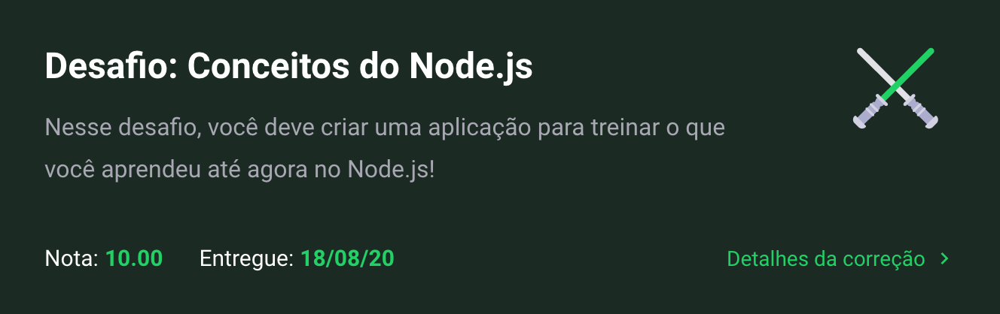
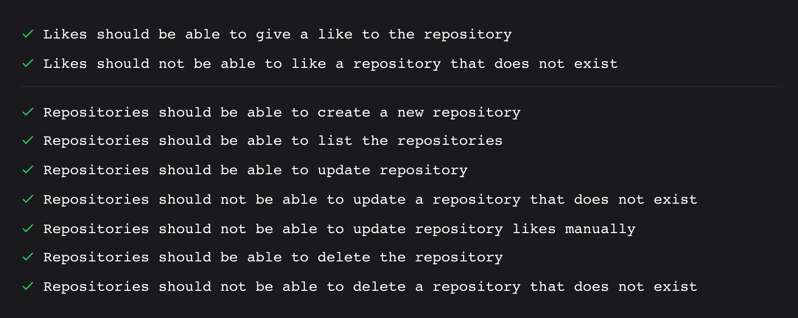

<h1 align="center">
  Challenge 01 - Course GoStack
</h1>

## What does the exercise aks for?

Now that you have the template cloned, and ready to continue, you must open the app.js file, and complete where there is no code with the code to achieve the objectives of each route.

POST / repositories: The route must receive title, url and techs within the body of the request, with the URL being the link to the github of this repository. When registering a new project, it must be stored inside an object in the following format: {id: "uuid", title: 'Desafio Node.js', url: 'http: //github.com / ...', techs: ["Node.js", "..."], likes: 0}; Make sure the ID is a UUID, and always start likes as 0.

GET / repositories: Route that lists all repositories;

PUT / repositories /: id: The route must change only the title, url and techs of the repository that has the id equal to the id present in the route parameters;

DELETE / repositories /: id: The route must delete the repository with the id present in the route parameters;

POST / repositories /: id / like: The route must increase the number of likes of the specific repository chosen through the id present in the route parameters, at each call of this route, the number of likes must be increased by 1;

## Does Guilherme made it?

Obviously :)

Here's my results:

